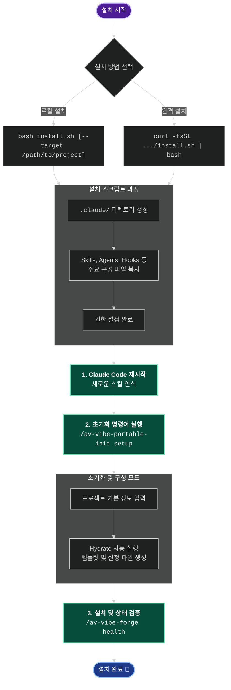

# AutoVibe Ecosystem

AutoVibe Ecosystem은 프로젝트에 필요한 다양한 스킬, 에이전트, 규칙 등을 설정하고 초기화하는 도구입니다.

## 🚀 설치 가이드

아래의 설치 프로세스 다이어그램과 상세 단계를 따라 프로젝트에 AutoVibe Ecosystem을 설치하고 초기화할 수 있습니다.

### 설치 프로세스 도식화 (Mermaid)



### 상세 설치 단계

**1. 설치 스크립트 실행**
프로젝트 환경에 맞게 로컬 스크립트를 실행하거나 원격지에서 직접 가져와 설치를 진행합니다.
- **로컬에서 설치할 경우**:
  ```bash
  bash install.sh [--target /path/to/project]
  ```
- **원격(GitHub 등)에서 설치할 경우**:
  ```bash
  curl -fsSL https://raw.githubusercontent.com/YOUR_ORG/autovibe-ecosystem/main/install.sh | bash
  ```

**2. Claude Code 재시작**
스크립트 실행이 완료되면, 새롭게 복사된 스킬과 파일들을 올바르게 인식하도록 **Claude Code를 재시작**합니다.

**3. 프로젝트 설정 및 초기화 (Setup)**
Claude Code 내에서 아래 명령을 전송하여 초기화 마법사를 실행합니다.
```text
/av-vibe-portable-init setup
```
> **안내**: 지시에 따라 프로젝트 구조 및 가이드를 입력하면 백그라운드에서 프로젝트 환경에 맞춰 `Hydrate` 작업이 자동 실행됩니다.

**4. 설치 상태 검증 (Health Check)**
초기화가 성공적으로 끝났는지 확인하기 위해 검증 명령을 실행합니다.
```text
/av-vibe-forge health
```

---
💡 **참고**: 모든 설치가 끝난 후 더 자세한 가이드라인은 `.claude/docs/av-portable-guide.md` 경로의 문서를 참조하시기 바랍니다.