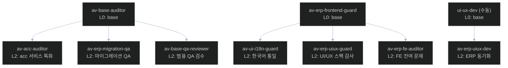
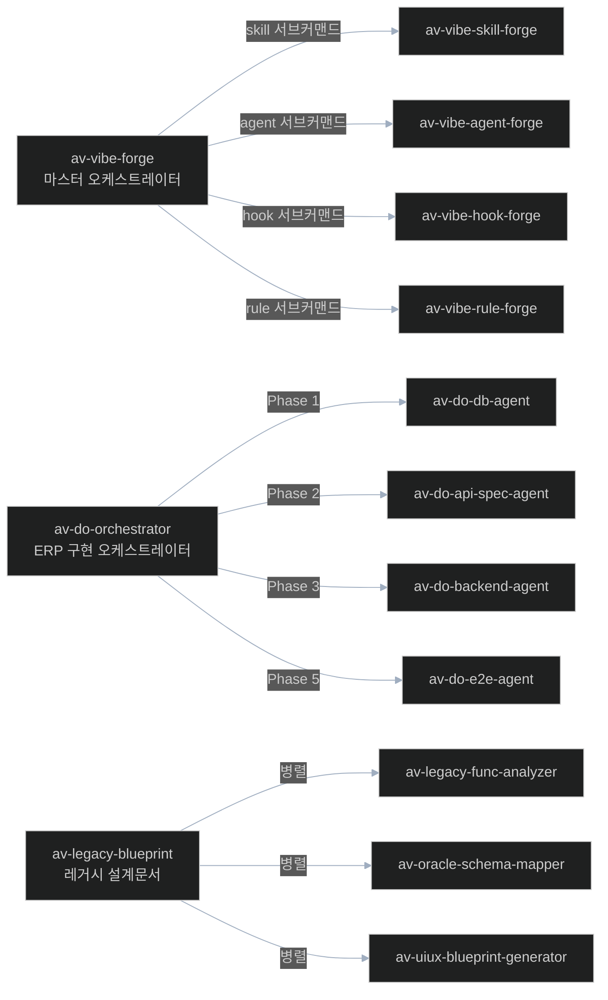
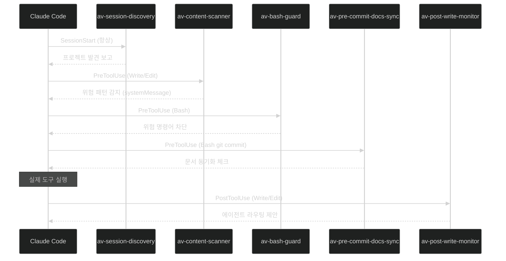

# AutoVibe 생태계 아키텍처

> 전체 인덱스: `README.md` | 컴포넌트 유형 상세: `component-types.md`

## 1. 3-Layer 아키텍처

AutoVibe는 3개 계층으로 구성된다. 각 계층은 역할이 명확히 분리된다.

```mermaid
%%{init: {"theme": "dark", "themeVariables": {"primaryColor": "#4a5568", "primaryTextColor": "#e2e8f0", "lineColor": "#a0aec0", "secondaryColor": "#2d3748", "tertiaryColor": "#1a202c"}}}%%
flowchart TD
    User([👤 사용자]) --> GW

    subgraph L3["Layer 3 — User Gateway"]
        GW["/av<br/>마스터 게이트웨이<br/>자연어 → 컴포넌트 선정"]
    end

    subgraph L2["Layer 2 — Domain Skills & Agents"]
        D1["av-do-orchestrator<br/>(ERP 구현)"]
        D2["av-erp-migration<br/>(레거시 전환)"]
        D3["av-legacy-blueprint<br/>(설계문서 생성)"]
        D4["av-base-code-quality<br/>(품질 검사)"]
        D5["av-base-git-commit<br/>(커밋 자동화)"]
        D6["av-base-auditor<br/>(감사)"]
        D7["... 70+ 컴포넌트"]
    end

    subgraph L1["Layer 1 — Meta Tools"]
        M1["av-vibe-forge<br/>(컴포넌트 생성/관리)"]
        M2["av-vibe-portable-init<br/>(이식 초기화)"]
        M3["av-vibe-migrator<br/>(레거시 마이그레이션)"]
    end

    GW --> D1 & D2 & D3 & D4 & D5
    D1 & D2 --> D6
    User --> M1 & M2 & M3

    style L3 fill:#2d3748,stroke:#4a5568
    style L2 fill:#1a202c,stroke:#4a5568
    style L1 fill:#1a202c,stroke:#718096
```



| 계층 | 역할 | 주요 컴포넌트 |
|------|------|-------------|
| L3 Gateway | 자연어 → 최적 컴포넌트 자동 선정 + 실행 위임 | `/av` |
| L2 Domain | 도메인별 전문 구현 스킬/에이전트 | `av-do-orchestrator`, `av-erp-migration` 등 70+ |
| L1 Meta | 생태계 자체를 생성·관리·이식하는 도구 | `av-vibe-forge`, `av-vibe-portable-init` 등 |

---

## 2. 4대 컴포넌트 유형 개요

AutoVibe 생태계는 4가지 유형의 컴포넌트로 구성된다.

```
현황 (components.json v3.1 기준):
  Agents : 31개  (.claude/agents/av-*.md)
  Skills : 40개  (.claude/skills/av-*/SKILL.md)
  Hooks  :  5개  (.claude/hooks/av-*.sh)
  Rules  :  4개  (.claude/rules/av-*.md)
  ────────────────────────────────
  합계   : 80개
```

| 유형 | 트리거 | 형태 | 역할 |
|------|--------|------|------|
| **Skill** | 사용자 `/명령어` | YAML frontmatter + Markdown | 스텝별 업무 처리 오케스트레이터 |
| **Agent** | Task() 호출 / 자동 트리거 | YAML frontmatter + Markdown | 특화된 AI 전문가 |
| **Hook** | Claude Code 이벤트 | Bash 셸 스크립트 | 자동화 감시/차단/안내 |
| **Rule** | 항상 활성 (컨텍스트 자동 주입) | Markdown | 전역 행동 규칙 |

---

## 3. Registry 시스템

`components.json`은 전체 생태계의 단일 진실 공급원(SSOT)이다.

### 파일 위치

```
.claude/registry/components.json
```

### 컴포넌트 레코드 구조

```json
{
  "agents": {
    "av-base-auditor": {
      "domain": "base",           // 도메인: vibe, base, util, erp, do, legacy, acc
      "tier": null,              // 계층: null, meta, platform, core, extended
      "version": "1.0",          // Major.Minor 문자열
      "inherits": null,          // 부모 컴포넌트 이름 (상속 시)
      "children": ["av-acc-auditor", "av-erp-migration-qa", "av-base-qa-reviewer"],
      "file": ".claude/agents/av-base-auditor.md",
      "memory": ".claude/agent-memory/av-base-auditor/MEMORY.md",
      "model": "sonnet",         // sonnet | haiku | opus
      "scope": ".claude/**, docs/**, CLAUDE.md",
      "status": "active",
      "created": "2026-02-21",
      "autovibe": true           // AutoVibe 생성 마커 (이식 가능 여부 판단)
    }
  },
  "skills": {
    "av-vibe-forge": {
      // ... 위와 유사
      "delegates-to": ["av-vibe-skill-forge", "av-vibe-agent-forge", ...],
      "user-invocable": true,    // 사용자 직접 호출 가능 여부
      "allowed-tools": [...]     // Skill 전용 (Agent는 tools 필드)
    }
  }
}
```

### 등록 규칙

- **등록 없이 생성 금지** — 반드시 `/av-vibe-forge` 통해 생성 (자동 등록)
- 버전 변경 시 `components.json`의 version 필드도 동시 갱신
- `portable: true` (domain in [vibe, base, util])` → 다른 프로젝트로 이식 가능

---

## 4. OOP 상속 시스템

상속 깊이 최대 3단계. Liskov 치환 원칙 적용.



### 상속 규칙

```
규칙 1: 자식의 scope는 부모보다 좁아야 함 (Liskov 원칙)
  ✅ av-base-auditor scope=".claude/**"
  ✅ av-acc-auditor scope="services/core/acc/**"  ← 더 좁음

규칙 2: 자식은 부모 로직을 모두 상속하고 전용 로직 추가
  → 부모 파일 Read 후 공통 로직 확인 필수

규칙 3: 상속 vs 위임 구분
  상속 (inherits): 부모 로직 포함 + scope 축소 + 전문화
  위임 (delegates-to): 독립 컴포넌트에 실행 위임 (포함 관계 없음)
```

자식 컴포넌트 필수 body 4섹션: `상속 컨텍스트`, `오버라이드 항목`, `공통 로직`, `{group} 전용 추가 로직`

상세 규칙: `.claude/docs/av-claude-code-spec/topics/naming-rules.md` §4

---

## 5. 위임(Delegation) 패턴

상속과 다른 패턴. 오케스트레이터가 전문 에이전트에게 실행을 맡긴다.



`delegates-to` 필드는 `components.json`에 배열 또는 `"dynamic"`으로 기록된다.

---

## 6. Hook 이벤트 사이클

5개의 Hook이 Claude Code 이벤트 라이프사이클에 연결된다.



| Hook | 유형 | 트리거 | 역할 |
|------|------|--------|------|
| `av-session-discovery` | SessionStart | 세션 시작 | 프로젝트 구조 발견 보고 |
| `av-content-scanner` | PreToolUse | Write/Edit | 보안 위험 패턴 감지 (import type, SQL injection 등) |
| `av-bash-guard` | PreToolUse | Bash | 위험 bash 명령어 차단 |
| `av-pre-commit-docs-sync` | PreToolUse | Bash (git commit) | 문서 동기화 누락 체크 |
| `av-post-write-monitor` | PostToolUse | Write/Edit | 가드 에이전트 라우팅 제안 + 리팩토링 힌트 |

### Hook 출력 형식 (Claude Code 표준)

```bash
# 정상 통과
echo "{}"

# 메시지 전달 (실행 계속)
echo '{"systemMessage": "경고 내용"}'

# 실행 차단 (PreToolUse만 가능)
echo '{"decision": "block", "reason": "차단 이유"}'
exit 2  # 또는 exit 0 + decision:block
```

---

## 참조

| 문서 | 내용 |
|------|------|
| `component-types.md` | 각 컴포넌트 유형 상세 스펙 + 예시 |
| `execution-flow.md` | 전체 실행 흐름 + 프로토콜 |
| `dev-guide.md` | 새 컴포넌트 만드는 법 |
| `.claude/docs/av-claude-code-spec/topics/naming-rules.md` | 네이밍 6대 규칙 |
| `.claude/registry/components.json` | 전체 컴포넌트 데이터 |
