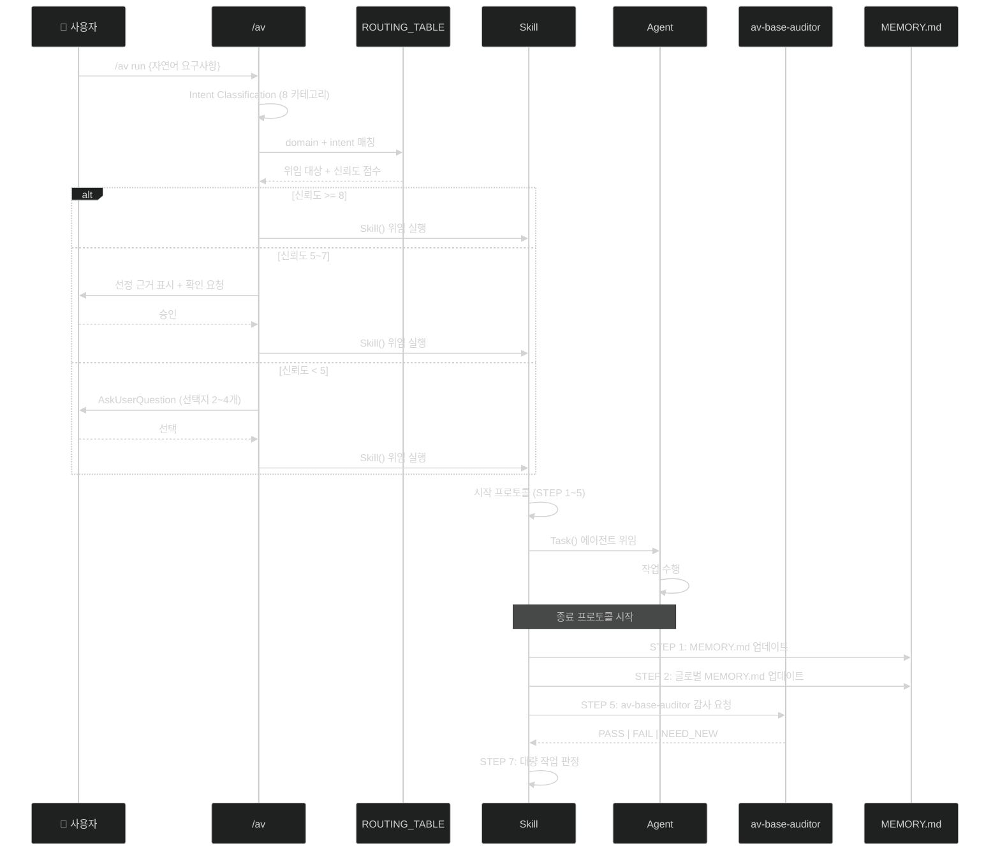
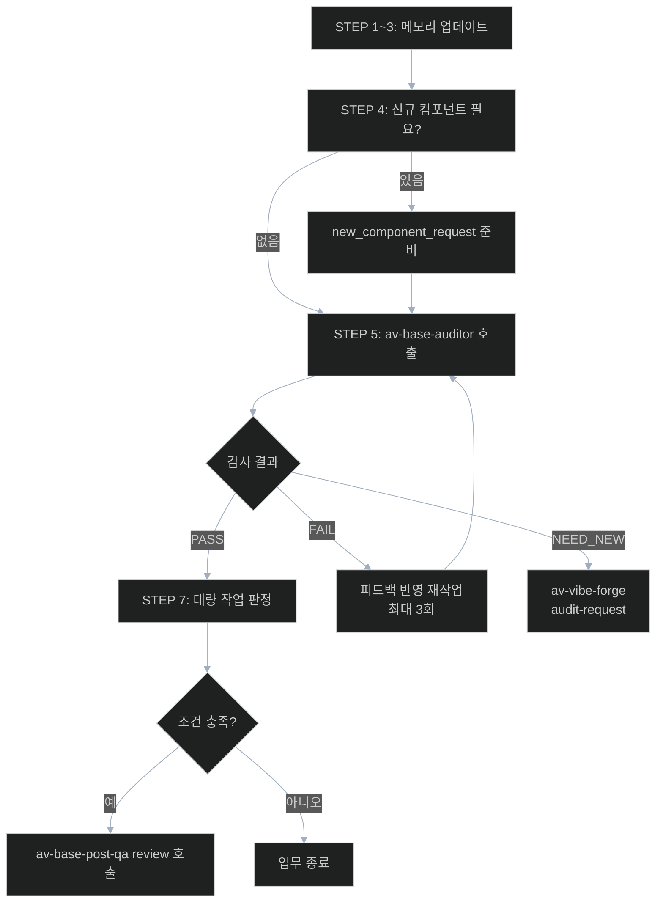
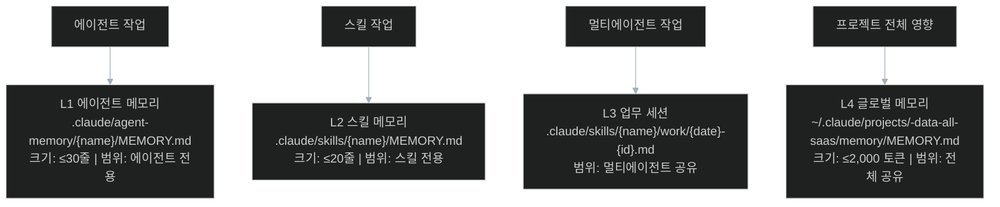
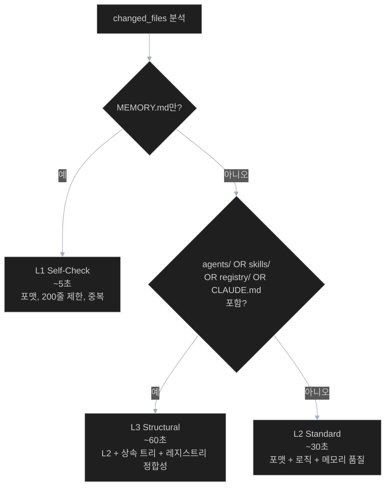

# AutoVibe 실행 흐름

> 전체 인덱스: `README.md` | 컴포넌트 유형 상세: `component-types.md`

---

## 1. 전체 실행 흐름

사용자 명령부터 메모리 저장까지의 완전한 흐름.



---

## 2. 시작 프로토콜 (5단계)

모든 Skill과 Agent에 공통 적용.

```
STEP 1: 자신의 MEMORY.md 존재 확인
        없으면 → SKILL-MEMORY.md.tmpl 또는 AGENT-MEMORY.md.tmpl로 생성

STEP 2: Read 자신의 MEMORY.md
        (Lazy Read: 인덱스 먼저, 토픽은 필요 시만)

STEP 3: Read 글로벌 MEMORY.md 상단 50줄
        (프로젝트 컨텍스트 — 현재 날짜, 모듈 상태 등)

STEP 4: 멀티에이전트이면
        → work 세션 파일 생성 또는 로드
        경로: .claude/skills/{skill}/work/{YYYY-MM-DD}-{id}.md

STEP 5: 작업 시작
```

### bkit 에이전트 vs 메인 세션의 차이

```
메인 세션 / general-purpose / Explore 에이전트:
  STEP 3 이전: MCP Memory (localhost:9095) 검색 먼저
  순서: MCP Memory → 로컬 MEMORY.md → Glob/Grep → 웹

bkit 에이전트 (gap-detector, pdca-iterator 등):
  MCP 접근 불가 — 로컬 파일만 사용
  순서: 로컬 MEMORY.md → Glob/Grep
```

상세: `.claude/rules/av-av-base-memory-first.md`

---

## 3. 종료 프로토콜 (7단계)

```
STEP 1: 학습 가치 있는 내용 판단
        있으면 → 자신의 MEMORY.md 업데이트 (Lazy: 관련 토픽만)

STEP 2: 전체 영향 핵심 내용 판단
        있으면 → 글로벌 MEMORY.md 업데이트

STEP 3: 멀티에이전트이면
        → work 파일에 완료 기록

STEP 4: 신규 컴포넌트 필요성 판단
        있으면 → 감사 에이전트에 new_component_request 전달

STEP 5: av-base-auditor 에이전트 호출 (감사 요청)
        전달: changed_files 목록 + task 요약 + work_session 경로

STEP 6: auditor PASS → STEP 7 진행
        auditor FAIL → 피드백 반영 → 재작업 (최대 3회)

STEP 7: [대량 작업 판정]
        트리거 조건 (하나 이상 해당 시):
          (a) changed_files >= 10개
          (b) batch_info.total_items >= 5개
          (c) task_type ∈ {batch, migration, generation, bulk, wave, run-all}

        → 대량 작업: /av-base-post-qa review 자동 호출
        → 일반 작업: 업무 종료
```

### 종료 프로토콜 흐름도



---

## 4. 메모리 시스템 4계층



### 계층별 저장 기준

| 계층 | 저장 대상 | 크기 한도 | 초과 조치 |
|------|---------|---------|---------|
| L1 에이전트 | 에이전트 고유 패턴, 최근 작업 이력 | ≤30줄 | 오래된 이력 삭제 |
| L2 스킬 | 스킬 설정값, 성공 패턴 | ≤20줄 | 빈 섹션 제거 |
| L3 세션 | 멀티에이전트 협업 상태 | 제한 없음 | 만료된 파일 삭제 |
| L4 글로벌 | PDCA 이력(최근 5), 프로젝트 전체 이슈 | ≤2,000 토큰 | PDCA 이력 최근 5 유지 |

### 중복 저장 금지

```
Known Bugs → L4 글로벌만 (다른 계층 복사 금지)
PDCA 이력 → L4 글로벌 최근 5개 유지
에이전트별 패턴 → L1에만
```

---

## 5. 감사 시스템 3레벨

감사 레벨은 변경된 파일 성격에 따라 자동 결정된다.



### 감사 체크리스트 4항목

```
체크 1: 포맷 준수
  - av- 접두사, kebab-case, 최대 4단어
  - autovibe: true
  - 필수 frontmatter 필드 모두 존재
  - 상속 시 scope Liskov 원칙

체크 2: 메모리 저장 품질
  - MEMORY.md 업데이트 여부 (미갱신 → FAIL)
  - 글로벌 메모리 전파 적절성
  - 크기 한도 준수

체크 3: 로직 정확성 (L2 이상)
  - {{PROJECT_NAME}} 컨벤션: {{ORM_NAME}} 7, {{BACKEND_FRAMEWORK}} 패턴, API 표준
  - 보안: import type 금지, SQL injection 방지, 비밀키 하드코딩 없음

체크 4: 신규 컴포넌트 필요성 (L3)
  - 기존 컴포넌트로 대체 가능 여부
  - 타당하면 NEED_NEW 판정 + av-vibe-forge audit-request 호출
```

### 감사 결과 유형

| 결과 | 의미 | 후속 행동 |
|------|------|---------|
| PASS | 모든 체크 통과 | STEP 7 대량 작업 판정 |
| FAIL | 체크 미통과 | 수정 요청 (최대 3회 재작업) |
| NEED_NEW | 신규 컴포넌트 필요 | av-vibe-forge audit-request 호출 |

### 감사 면제 규칙

```
av-base-auditor 자체 변경
  → L1 Self-Check만 (순환 참조 방지)
  → 구조 변경 시 AskUserQuestion 사용자 확인 필수

av-base-post-qa / av-base-qa-reviewer 자체 변경
  → L1 Self-Check만 (자기 감사 면제)
  → STEP 7 대량 작업 판정도 생략
```

---

## 6. av 게이트웨이 신뢰도 계산

`/av run` 실행 시 ROUTING_TABLE 매칭 신뢰도로 실행 방식 결정.

```
신뢰도 계산:
  카테고리 매칭 (키워드 존재): +4점
  도메인 매칭 (모듈명/레이어 명시): +3점
  스코프 매칭 (erp/legacy/meta 명시): +2점
  이력 매칭 (이전 성공 이력): +1점

분기:
  >= 8: 직접 실행 (사용자 확인 없음)
  5~7:  근거 표시 후 확인
  < 5:  AskUserQuestion → 선택지 2~4개 제시
```

8개 Intent 카테고리:

| 카테고리 | 주요 키워드 | 위임 대상 |
|---------|----------|---------|
| creation | 구현, 생성, build | av-do-orchestrator |
| analysis | 분석, 검토, audit | av-base-auditor |
| migration | 마이그레이션, legacy | av-erp-migration |
| optimization | 최적화, 리팩토링 | av-base-refactor |
| documentation | 문서, 설계, blueprint | av-legacy-blueprint |
| testing | 테스트, E2E, QA | av-e2e-ui-tester |
| configuration | 커밋, 동기화, sync | av-base-git-commit |
| meta-management | skill 생성, forge | av-vibe-forge |

---

## 참조

| 문서 | 내용 |
|------|------|
| `architecture.md` | 3-Layer 구조 + Hook 이벤트 사이클 |
| `component-types.md` | 각 컴포넌트 유형 상세 |
| `dev-guide.md` | 새 컴포넌트 만드는 법 |
| `.claude/docs/av-claude-code-spec/topics/protocols.md` | 프로토콜 상세 스펙 |
| `.claude/docs/av-claude-code-spec/topics/audit-rules.md` | 감사 규칙 상세 |
