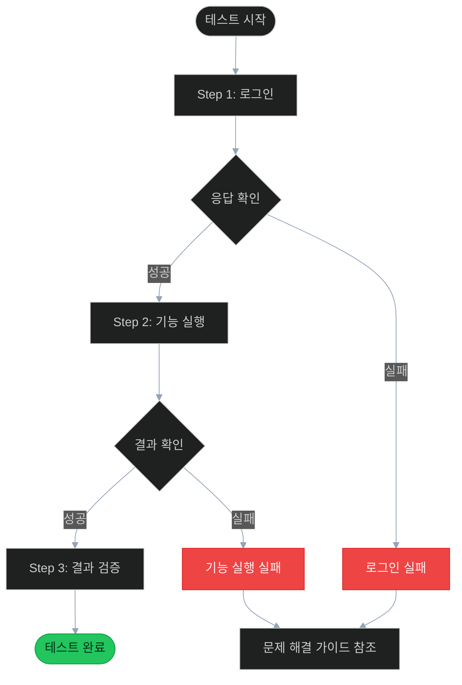

# E2E Doc Gen - QA 수동 테스트 가이드 생성기

> **목적**: E2E 테스트 코드를 분석하여 **QA 테스터가 수동으로 따라할 수 있는 단계별 가이드**를 생성합니다.
>
> 비개발자도 이해할 수 있는 명확한 테스트 절차서를 작성합니다.

---

## 명령어

| 명령어 | 설명 | 예시 |
|--------|------|------|
| `generate [file]` | 단일 테스트 → QA 가이드 생성 | `/e2e-doc-gen generate test_auth.py` |
| `batch [dir]` | 디렉토리 전체 문서 생성 | `/e2e-doc-gen batch e2e/api/` |
| `update [file]` | 기존 문서 업데이트 | `/e2e-doc-gen update test_auth.md` |
| `template [type]` | 템플릿 표시 (api/web/qa) | `/e2e-doc-gen template qa` |
| `validate [dir]` | 문서-테스트 일치 검증 | `/e2e-doc-gen validate e2e/api/docs/` |
| `list [dir]` | 문서화 현황 목록 | `/e2e-doc-gen list e2e/` |

---

## 문서 생성 워크플로우

### 1. 테스트 파일 분석
- 파일 타입 감지 (`.py` → pytest, `.spec.ts` → Playwright)
- Given-When-Then 패턴 추출
- 테스트 단계(Steps) 식별

### 2. QA 가이드 생성
- 사전 조건 (환경 설정)
- **단계별 테스트 절차** (스텝 바이 스텝)
- 예상 결과
- 검증 체크리스트
- 실패 시 확인 사항

### 3. 출력
- `{dir}/docs/{test_name}.md` (QA 가이드)

---

## QA 테스트 가이드 템플릿

### API 테스트용 (pytest → 수동 테스트)

```markdown
# {테스트명} - QA 수동 테스트 가이드

> **파일**: `{test_file}.py`
> **카테고리**: {category}
> **우선순위**: {priority}
> **예상 소요 시간**: {estimated_time}

---

## 1. 개요

**테스트 목적**: {테스트하고자 하는 기능/시나리오 설명}

### 테스트 범위

| 항목 | 내용 |
|------|------|
| 대상 서비스 | {service-name} |
| 대상 API | {endpoint} |
| 테스트 유형 | {정상/비정상/경계값} |

---

## 2. 사전 조건

### 환경 확인

테스트 전 아래 항목을 확인하세요:

- [ ] Docker 환경 실행 중인지 확인
  ```bash
  docker compose ps
  # 모든 서비스가 Up 상태여야 함
  ```

- [ ] 테스트 대상 서비스 접속 가능 확인
  ```bash
  curl http://localhost:{port}/health
  # {"status":"ok"} 응답 확인
  ```

- [ ] 테스트 계정 준비
  | 항목 | 값 |
  |------|-----|
  | 테넌트 | {tenant_alias} |
  | 아이디 | {login_id} |
  | 비밀번호 | {password} |

### 필요한 도구

- 브라우저 (Chrome/Firefox)
- API 테스트 도구 (Postman/Insomnia/curl)
- 개발자 도구 (F12)

---

## 3. 테스트 절차

### TC-001: {테스트 케이스명}

**목적**: {이 테스트 케이스의 목적}

#### Step 1: {단계명}

**수행 방법**:
1. {구체적인 수행 방법}
2. {필요한 입력값 또는 클릭할 버튼}

**API 호출 예시** (curl):
```bash
curl -X POST http://localhost:{port}/api/{endpoint} \
  -H "Content-Type: application/json" \
  -d '{
    "field1": "value1",
    "field2": "value2"
  }'
```

**예상 결과**:
- HTTP 상태 코드: `{expected_status}`
- 응답 본문에 포함되어야 할 내용:
  ```json
  {
    "success": true,
    "data": { ... }
  }
  ```

**확인 체크리스트**:
- [ ] 응답 코드가 {expected_status}인가?
- [ ] 응답에 {expected_field}가 포함되어 있는가?
- [ ] {추가 검증 항목}

---

#### Step 2: {다음 단계명}

**수행 방법**:
...

---

### TC-002: {오류 케이스명}

**목적**: {오류 상황에서의 시스템 동작 확인}

#### Step 1: 잘못된 입력으로 요청

**수행 방법**:
1. {잘못된 값으로 요청 시도}

**API 호출 예시**:
```bash
curl -X POST http://localhost:{port}/api/{endpoint} \
  -H "Content-Type: application/json" \
  -d '{
    "field1": "invalid_value"
  }'
```

**예상 결과**:
- HTTP 상태 코드: `{error_status}` (예: 400, 401, 404)
- 오류 메시지 포함:
  ```json
  {
    "error": "{error_code}",
    "message": "{error_message}"
  }
  ```

---

## 4. 전체 플로우 다이어그램

> Mermaid 다이어그램은 `/mermaid` 스킬 표준을 준수합니다.



---

## 5. 테스트 결과 기록

### 결과 체크리스트

| TC | 테스트 케이스 | 결과 | 비고 |
|----|--------------|------|------|
| TC-001 | {테스트명} | ⬜ Pass / ⬜ Fail | |
| TC-002 | {오류 케이스명} | ⬜ Pass / ⬜ Fail | |

### 증거 수집

테스트 완료 후 아래 자료를 첨부하세요:
- [ ] API 응답 스크린샷
- [ ] 콘솔 로그 (오류 발생 시)
- [ ] 네트워크 탭 캡처

---

## 6. 문제 해결 가이드

### 자주 발생하는 문제

#### 문제 1: 서비스 연결 실패
**증상**: `Connection refused` 오류
**원인**: Docker 서비스가 실행되지 않음
**해결**:
```bash
docker compose --profile core --profile backend up -d
```

#### 문제 2: 인증 토큰 오류
**증상**: `401 Unauthorized` 응답
**원인**: 토큰 만료 또는 잘못된 토큰
**해결**: 다시 로그인하여 새 토큰 발급

#### 문제 3: {테스트 특화 문제}
**증상**: {증상}
**원인**: {원인}
**해결**: {해결 방법}

---

## 7. 관련 정보

### 연관 테스트

- [{관련_테스트_1}](./related_test_1.md)
- [{관련_테스트_2}](./related_test_2.md)

### 참고 문서

- API 명세: {API 문서 링크}
- 기능 명세: {기능 명세 링크}

---

> **문서 생성일**: {date}
> **원본 테스트 파일**: `{test_file_path}`
```

---

### Web 테스트용 (Playwright → 수동 UI 테스트)

```markdown
# {테스트명} - QA UI 테스트 가이드

> **파일**: `{test_file}.spec.ts`
> **대상 화면**: {screen_name}
> **우선순위**: {priority}
> **예상 소요 시간**: {estimated_time}

---

## 1. 개요

**테스트 목적**: {테스트하고자 하는 UI 기능/시나리오 설명}

### 테스트 범위

| 항목 | 내용 |
|------|------|
| 대상 앱 | {app-name} (예: admin-web) |
| 대상 페이지 | {page_url} |
| 테스트 유형 | {UI 기능/사용자 시나리오} |

---

## 2. 사전 조건

### 환경 확인

- [ ] 앱 접속 가능 확인
  - Admin Web: http://localhost:8080/admin
  - Chat Web: http://localhost:8080/chat

- [ ] 테스트 계정으로 로그인 가능 확인
  | 항목 | 값 |
  |------|-----|
  | 테넌트 | CNF |
  | 아이디 | master |
  | 비밀번호 | master1234! |

- [ ] 브라우저 설정
  - 캐시/쿠키 삭제
  - 화면 크기: 1920x1080 권장

---

## 3. 테스트 절차

### TC-001: {테스트 케이스명}

**목적**: {이 테스트 케이스의 목적}

#### Step 1: 페이지 접근

**수행 방법**:
1. 브라우저를 엽니다
2. URL 입력: `http://localhost:8080/{path}`
3. Enter 키를 누릅니다

**예상 결과**:
- {페이지명} 페이지가 표시됨
- {주요 요소}가 화면에 보임

**스크린샷 위치**:
```
[📸 여기에 스크린샷 첨부]
```

---

#### Step 2: {동작 수행}

**수행 방법**:
1. `{버튼/링크/입력필드}` 를 찾습니다
   - 위치: {화면 내 위치 설명}
   - 형태: {버튼/링크/텍스트필드}

2. {입력값}을 입력합니다 (해당 시)
3. `{버튼명}` 버튼을 클릭합니다

**예상 결과**:
- {동작 후 예상되는 화면 변화}
- {표시되어야 할 메시지 또는 요소}

**확인 체크리스트**:
- [ ] {요소 1}이 화면에 표시되는가?
- [ ] {메시지}가 나타나는가?
- [ ] URL이 {expected_url}로 변경되었는가?

---

#### Step 3: 결과 확인

**수행 방법**:
1. {결과 확인 위치}로 이동합니다
2. {확인할 항목}을 확인합니다

**예상 결과**:
- {저장된 데이터/변경된 상태}가 반영됨

---

## 4. 화면 플로우


---

## 5. UI 요소 위치 가이드

### 주요 요소 위치

| 요소 | 위치 | 식별 방법 |
|------|------|----------|
| {로그인 버튼} | 화면 중앙 | "로그인" 텍스트 |
| {메뉴} | 좌측 사이드바 | {아이콘} 아이콘 |
| {입력 필드} | 폼 내부 | "{라벨}" 라벨 아래 |

### 화면 레이아웃

```
┌─────────────────────────────────────────────┐
│  [로고]     [메뉴1] [메뉴2]    [사용자 ▼]   │  ← 헤더
├─────────┬───────────────────────────────────┤
│         │                                   │
│  [메뉴] │     [메인 콘텐츠 영역]            │
│         │                                   │
│  - 항목1│     [테이블/폼/카드]             │
│  - 항목2│                                   │
│  - 항목3│     [버튼] [버튼]                 │
│         │                                   │
└─────────┴───────────────────────────────────┘
```

---

## 6. 테스트 결과 기록

### 결과 체크리스트

| TC | 테스트 케이스 | 결과 | 스크린샷 | 비고 |
|----|--------------|------|---------|------|
| TC-001 | {테스트명} | ⬜ Pass / ⬜ Fail | | |
| TC-002 | {오류 케이스명} | ⬜ Pass / ⬜ Fail | | |

### 증거 수집

- [ ] 각 Step 완료 시 스크린샷
- [ ] 오류 발생 시 오류 메시지 스크린샷
- [ ] 브라우저 콘솔 로그 (오류 시)

---

## 7. 문제 해결 가이드

### 자주 발생하는 문제

#### 문제 1: 페이지 로딩 안됨
**증상**: 빈 화면 또는 로딩 스피너 계속 표시
**원인**: 백엔드 서비스 미실행
**해결**:
```bash
docker compose --profile core --profile backend up -d
```

#### 문제 2: 로그인 후 리다이렉션 안됨
**증상**: 로그인 성공 후 화면 변화 없음
**원인**: 쿠키/세션 문제
**해결**: 브라우저 캐시 삭제 후 재시도

---

## 8. 자동화 테스트 실행 (참고)

개발자/QA 엔지니어는 아래 명령으로 자동화 테스트 실행 가능:

```bash
# 전체 테스트 실행
{{PKG_MANAGER}} --filter "{apps/{app-name}}" test

# 특정 테스트 파일 실행
{{PKG_MANAGER}} --filter "{apps/{app-name}}" test -- {test_path}

# 브라우저 표시 모드 (디버깅)
{{PKG_MANAGER}} --filter "{apps/{app-name}}" test -- {test_path} --headed

# 디버그 모드
PWDEBUG=1 {{PKG_MANAGER}} --filter "{apps/{app-name}}" test -- {test_path}
```

---

> **문서 생성일**: {date}
> **원본 테스트 파일**: `{test_file_path}`
```

---

## 자동 감지 규칙

### 서비스 포트 매핑

| 서비스 | 포트 | Nginx 경로 |
|--------|------|-----------|
| admin-api | 4000 | /api/admin |
| chat-api | 4002 | /api/chat |
| auth-api | 4003 | /api/auth |
| ai-rag | 4010 | /api/ai-rag |
| erp-mcp | 4020 | /api/erp-mcp |
| sql-runner | 4030 | /api/sql-runner |
| admin-web | 3001 | /admin |
| chat-web | 3000 | /chat |

### 기본 테스트 계정

| 환경 | 테넌트 | 아이디 | 비밀번호 |
|------|-------|-------|---------|
| 개발 | CNF | master | master1234! |
| 테스트 | E2E_TEST | e2e-test-admin | TestAdmin1234! |

### Given-When-Then 추출

```python
# 테스트 코드에서 자동 추출
"""
Given: 유효한 사용자 정보
When: 로그인 API 호출
Then: 200 응답과 함께 토큰 반환
"""
# → QA 가이드의 Step으로 변환
```

---

## 사용 예시

```bash
# API 테스트 → QA 가이드 생성
/e2e-doc-gen generate e2e/api/test_auth_flow.py

# Web 테스트 → UI 테스트 가이드 생성
/e2e-doc-gen generate apps/admin-web/test/e2e/auth.spec.ts

# 배치 생성 (전체 디렉토리)
/e2e-doc-gen batch e2e/api/

# 문서화 현황 확인
/e2e-doc-gen list e2e/

# 문서-테스트 일치 검증
/e2e-doc-gen validate e2e/api/docs/
```

---

## 문서 품질 체크리스트

생성된 QA 가이드는 아래 기준을 만족해야 합니다:

- [ ] **명확성**: 비개발자도 따라할 수 있는 수준
- [ ] **완전성**: 모든 테스트 케이스가 문서화됨
- [ ] **재현성**: 동일한 절차로 동일한 결과 재현 가능
- [ ] **증거 수집**: 스크린샷/로그 수집 가이드 포함
- [ ] **문제 해결**: 일반적인 오류 상황과 해결책 포함

---

## Multi-AI 호환성

| 플랫폼 | 위치 | 동기화 |
|--------|------|--------|
| Claude Code | `.claude/skills/e2e-doc-gen/` | Source of Truth |
| Gemini CLI | `.gemini/skills/e2e-doc-gen/` | 전체 복사 |
| Google Antigravity | `.agent/skills/e2e-doc-gen/` | SKILL.md만 |

---

## 자동 트리거

다음 키워드 감지 시 자동 제안:

| 키워드 | 언어 |
|--------|------|
| "QA 가이드", "테스트 절차서", "수동 테스트" | 한국어 |
| "QA guide", "test procedure", "manual test" | English |
| "QAガイド", "テスト手順書" | 日本語 |

---

> e2e-doc-gen v2.0.0 | QA Manual Test Guide Generator
