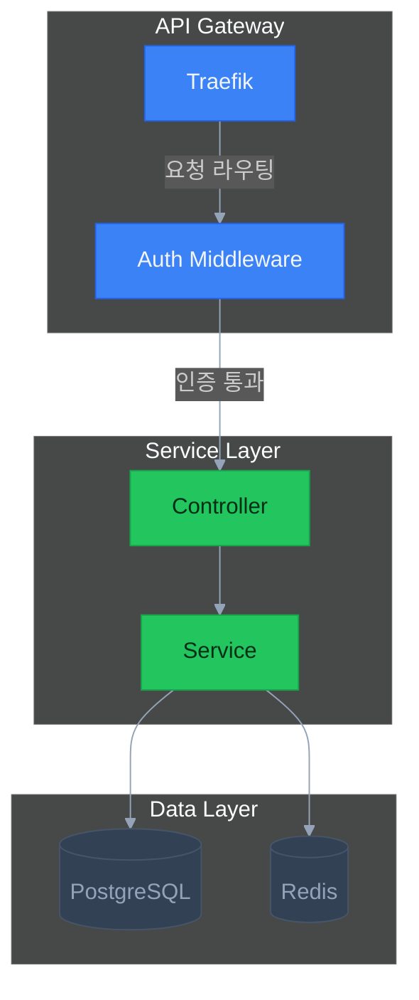
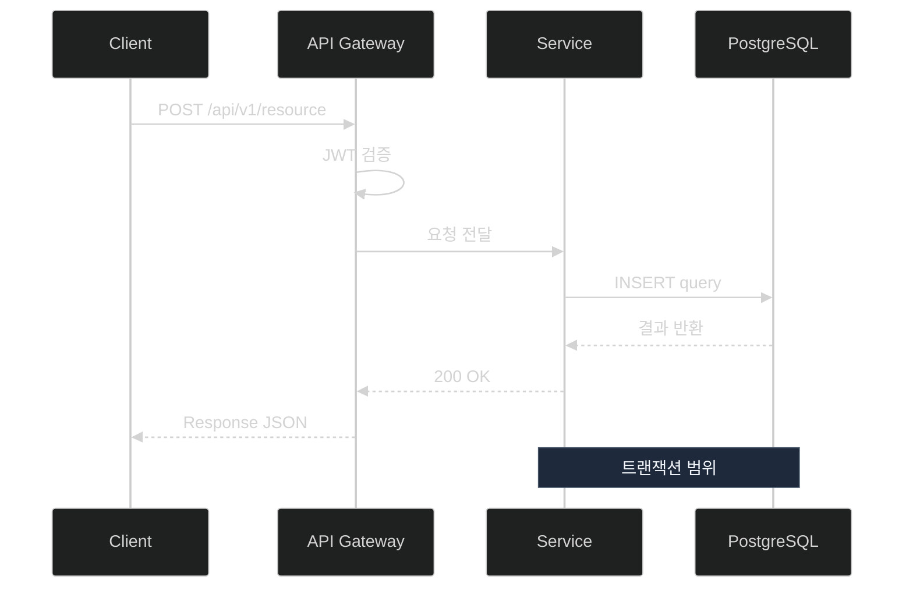
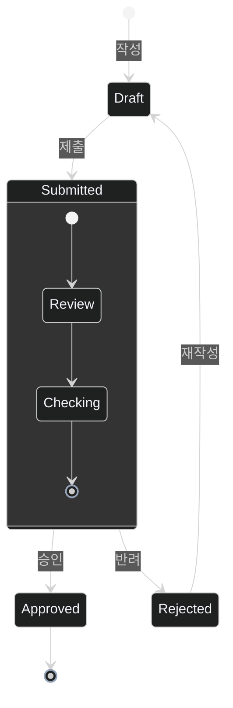
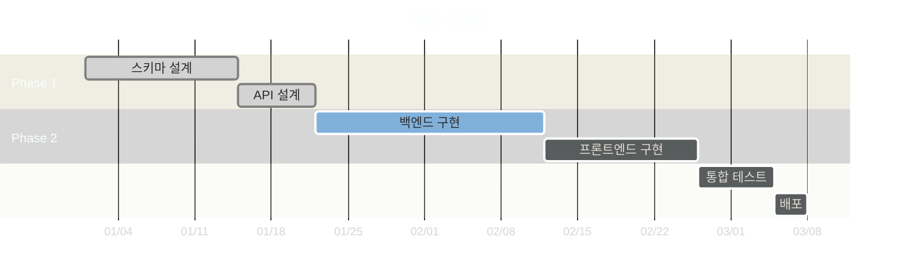
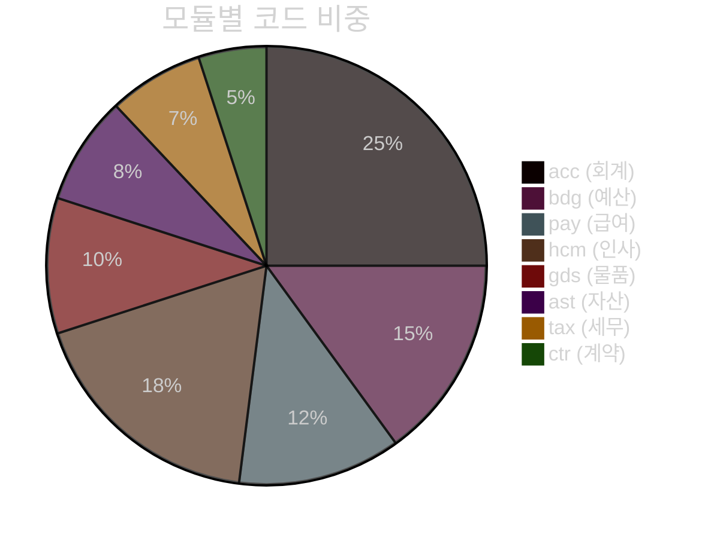

# Mermaid Diagram Standard Reference

> {{PROJECT_NAME}} 프로젝트의 모든 Mermaid 다이어그램을 통일된 디자인으로 작성하기 위한 표준 레퍼런스.
>
> 기본 규칙은 `.claude/rules/av-util-mermaid-standard.md`에 정의되어 있으며, 이 스킬은 상세 템플릿과 검증 도구를 제공합니다.

---

## 명령어

| 명령어 | 설명 | 예시 |
|--------|------|------|
| `template [type]` | 다이어그램 유형별 복사용 템플릿 출력 | `/mermaid template sequence` |
| `validate [file]` | 파일 내 Mermaid 문법 검증 | `/mermaid validate docs/02-design/acc/README.md` |
| `palette` | 전체 색상 팔레트 출력 | `/mermaid palette` |
| `examples` | 실제 사용 예시 모음 | `/mermaid examples` |

---

## 색상 팔레트 ({{PROJECT_NAME}} Standard)

### 기본 테마 변수

| 변수 | 색상 | 용도 |
|------|------|------|
| `primaryColor` | `#3b82f6` | 주요 노드 배경 (blue-500) |
| `primaryTextColor` | `#f1f5f9` | 주요 노드 텍스트 (slate-100) |
| `primaryBorderColor` | `#60a5fa` | 주요 노드 테두리 (blue-400) |
| `lineColor` | `#94a3b8` | 연결선 (slate-400) |
| `secondaryColor` | `#8b5cf6` | 보조 노드 배경 (violet-500) |
| `tertiaryColor` | `#334155` | 배경/subgraph (slate-700) |
| `noteTextColor` | `#f1f5f9` | 노트 텍스트 (slate-100) |
| `noteBkgColor` | `#1e293b` | 노트 배경 (slate-800) |
| `noteBorderColor` | `#475569` | 노트 테두리 (slate-600) |

### 강조 classDef

| classDef | 배경색 | 테두리 | 텍스트 | 용도 |
|----------|--------|--------|--------|------|
| `primary` | `#3b82f6` | `#2563eb` | `#f1f5f9` | 핵심 컴포넌트 |
| `success` | `#22c55e` | `#16a34a` | `#052e16` | 완료/성공 상태 |
| `warning` | `#eab308` | `#ca8a04` | `#1a2e05` | 주의/경고 상태 |
| `error` | `#ef4444` | `#dc2626` | `#fef2f2` | 오류/위험 상태 |
| `info` | `#06b6d4` | `#0891b2` | `#f1f5f9` | 정보/참고 |
| `muted` | `#334155` | `#475569` | `#94a3b8` | 비활성/참고용 |

### 레이어별 style (아키텍처 다이어그램용)

| 레이어 | fill | stroke | 용도 |
|--------|------|--------|------|
| Gateway | `#1e3a5f` | `#60a5fa` | API Gateway, 라우터 |
| Controller | `#3b82f6` | `#2563eb` | 컨트롤러, 엔드포인트 |
| Service | `#8b5cf6` | `#7c3aed` | 비즈니스 로직 |
| Repository | `#06b6d4` | `#0891b2` | 데이터 접근 |
| Database | `#334155` | `#475569` | DB, 스토리지 |
| External | `#f59e0b` | `#d97706` | 외부 서비스 |

---

## 표준 init 블록

모든 다이어그램의 첫 줄에 반드시 포함:

````markdown
```mermaid
%%{init: {'theme': 'dark', 'themeVariables': {
  'primaryColor': '#3b82f6',
  'primaryTextColor': '#f1f5f9',
  'primaryBorderColor': '#60a5fa',
  'lineColor': '#94a3b8',
  'secondaryColor': '#8b5cf6',
  'tertiaryColor': '#334155',
  'noteTextColor': '#f1f5f9',
  'noteBkgColor': '#1e293b',
  'noteBorderColor': '#475569'
}}}%%
```
````

---

## 다이어그램 유형별 템플릿

### 1. flowchart (시스템 구성도 / 아키텍처)

````markdown

````

**방향 가이드**:
- `flowchart TD` — 시스템 아키텍처, 계층 구조 (위→아래)
- `flowchart LR` — 모듈 의존성, 데이터 흐름 (좌→우)
- `flowchart BT` — 상향식 구조 (아래→위)

### 2. sequenceDiagram (요청 처리 흐름)

````markdown

````

**참여자 규칙**:
- 한글 표시: `participant 별칭 as 한글이름` 형식 필수
- 아이콘: 텍스트 앞에 이모지 사용 가능 (`participant C as Client`)
- 순서: 좌→우로 호출 방향과 일치하게 선언

### 3. erDiagram (DB 스키마)

````markdown
```mermaid
%%{init: {'theme': 'dark', 'themeVariables': {
  'primaryColor': '#3b82f6', 'primaryTextColor': '#f1f5f9',
  'primaryBorderColor': '#60a5fa', 'lineColor': '#94a3b8',
  'secondaryColor': '#8b5cf6', 'tertiaryColor': '#334155',
  'noteTextColor': '#f1f5f9', 'noteBkgColor': '#1e293b',
  'noteBorderColor': '#475569'
}}}%%
erDiagram
  Account ||--o{ AccountDetail : "1:N 상세"
  Account }o--|| Department : "N:1 부서"
  Account {
    string id PK
    string {{MULTI_TENANT_FIELD}} FK
    string accountCode UK
    string accountName
    string description
    datetime createdAt
    datetime updatedAt
  }
  AccountDetail {
    string id PK
    string accountId FK
    string {{MULTI_TENANT_FIELD}} FK
    decimal amount
    string memo
  }
  Department {
    string id PK
    string {{MULTI_TENANT_FIELD}} FK
    string deptCode UK
    string deptName
  }
```
````

**카디널리티 표기**:
| 표기 | 의미 |
|------|------|
| `\|\|--o{` | 1:N (필수:선택) |
| `\|\|--\|\|` | 1:1 (필수:필수) |
| `}o--o{` | N:M (선택:선택) |
| `}o--\|\|` | N:1 (선택:필수) |

### 4. classDiagram (클래스 구조)

````markdown
```mermaid
%%{init: {'theme': 'dark', 'themeVariables': {
  'primaryColor': '#3b82f6', 'primaryTextColor': '#f1f5f9',
  'primaryBorderColor': '#60a5fa', 'lineColor': '#94a3b8',
  'secondaryColor': '#8b5cf6', 'tertiaryColor': '#334155',
  'noteTextColor': '#f1f5f9', 'noteBkgColor': '#1e293b',
  'noteBorderColor': '#475569'
}}}%%
classDiagram
  class AccountService {
    -prisma: {{ORM_NAME}}Service
    -cache: CacheService
    +findAll({{MULTI_TENANT_FIELD}}, query) Promise~PaginatedResult~
    +findById({{MULTI_TENANT_FIELD}}, id) Promise~Account~
    +create({{MULTI_TENANT_FIELD}}, dto) Promise~Account~
    +update({{MULTI_TENANT_FIELD}}, id, dto) Promise~Account~
    +delete({{MULTI_TENANT_FIELD}}, id) Promise~void~
  }

  class AccountController {
    -service: AccountService
    +getAll(query) PaginatedResult
    +getById(id) Account
    +create(dto) Account
  }

  AccountController --> AccountService : DI
  AccountService --> {{ORM_NAME}}Service : DI
  AccountService --> CacheService : DI
```
````

**접근제어자**: `+` public, `-` private, `#` protected, `~` package

### 5. stateDiagram-v2 (상태 전이)

````markdown

````

### 6. gantt (일정/진행률)

````markdown

````

### 7. pie (비율 차트)

````markdown

````

---

## 다이어그램 유형 선택 가이드

| 문서 유형 | 권장 다이어그램 | Mermaid 타입 |
|-----------|----------------|-------------|
| 시스템 아키텍처 | 계층 구조도 | `flowchart TD` |
| 모듈 의존성 | 관계도 | `flowchart LR` |
| API 요청 흐름 | 시퀀스 | `sequenceDiagram` |
| DB 스키마 관계 | ER 다이어그램 | `erDiagram` |
| 클래스/서비스 구조 | 클래스 다이어그램 | `classDiagram` |
| 비즈니스 프로세스 상태 | 상태 전이 | `stateDiagram-v2` |
| 일정/진행률 | 간트 차트 | `gantt` |
| 비율/통계 | 파이 차트 | `pie` |
| 컴포넌트 계층 | 트리 구조 | `flowchart TD` (graph TD) |

---

## 오류 방지 규칙 (상세)

### 1. init 블록 위치

```
// GOOD
%%{init: {'theme': 'dark', ...}}%%
flowchart TD
  A --> B

// BAD - init이 첫 줄이 아님
flowchart TD
  %%{init: {'theme': 'dark', ...}}%%
  A --> B
```

### 2. 노드 ID 규칙

```
// GOOD - 영문+숫자 ID, 한글은 텍스트 안에
A["회계 모듈"]
SVC01["서비스 레이어"]

// BAD - 한글 ID
회계모듈["회계 모듈"]
서비스["서비스 레이어"]
```

### 3. 특수문자 이스케이프

```
// GOOD - 괄호를 포함한 텍스트
A["findAll({{MULTI_TENANT_FIELD}})"]
B["DB 조회 (PostgreSQL)"]

// BAD - 이스케이프 없음 (파싱 오류)
A[findAll({{MULTI_TENANT_FIELD}})]
B[DB 조회 (PostgreSQL)]
```

### 4. 연결선 레이블

```
// GOOD
A -->|"데이터 전달"| B
A -.->|"비동기"| C

// BAD - 따옴표 누락 (한글 시 오류 가능)
A -->|데이터 전달| B
```

### 5. subgraph ID

```
// GOOD
subgraph SVC["서비스 레이어"]
subgraph DATA_LAYER["데이터 계층"]

// BAD - 공백, 특수문자
subgraph 서비스 레이어
subgraph Data Layer
```

### 6. sequenceDiagram 참여자

```
// GOOD - alias 사용
participant C as 클라이언트
participant SVC as 서비스

// BAD - 한글 직접 사용
participant 클라이언트
participant 서비스
```

### 7. flowchart 방향

```
// GOOD - 방향 명시
flowchart TD
flowchart LR

// BAD - 방향 누락
flowchart
graph
```

### 8. classDiagram 제네릭

```
// GOOD - ~ 사용
+findAll() Promise~Account[]~

// BAD - <> 사용 (HTML로 해석됨)
+findAll() Promise<Account[]>
```

### 9. 노드 텍스트 줄바꿈

```
// GOOD - <br/> 사용
A["첫번째 줄<br/>두번째 줄"]

// BAD - \n 사용 (동작 안 함)
A["첫번째 줄\n두번째 줄"]
```

### 10. 빈 subgraph 금지

```
// GOOD
subgraph SVC["서비스"]
  A["컨트롤러"]
end

// BAD - 빈 subgraph (렌더링 오류)
subgraph SVC["서비스"]
end
```

---

## 노드 설명 테이블 규칙

Human 대상 문서에서는 모든 Mermaid 다이어그램 직후에 노드 설명 테이블을 포함합니다:

```markdown
#### {다이어그램 제목} 노드 설명

| 노드 | 역할 | 설명 |
|------|------|------|
| A | API Gateway | 요청 라우팅 및 인증 처리 |
| B | Service | 비즈니스 로직 실행 |
| C | Database | 데이터 영속화 |
```

---

## validate 명령어 체크리스트

`/mermaid validate` 실행 시 아래 항목을 검증합니다:

- [ ] 모든 Mermaid 블록에 다크모드 init 포함
- [ ] 색상이 {{PROJECT_NAME}} 표준 팔레트와 일치
- [ ] 노드 ID가 영문+숫자만 사용
- [ ] 한글 텍스트가 `[""]` 또는 `("")` 안에 존재
- [ ] 연결선 레이블이 `|""|` 형식
- [ ] sequenceDiagram 참여자에 alias 사용
- [ ] flowchart 방향 명시
- [ ] subgraph ID에 공백/특수문자 없음
- [ ] 빈 subgraph 없음
- [ ] 노드 텍스트 줄바꿈에 `\n` 대신 `<br/>` 사용
- [ ] Human 대상 문서에 노드 설명 테이블 존재
